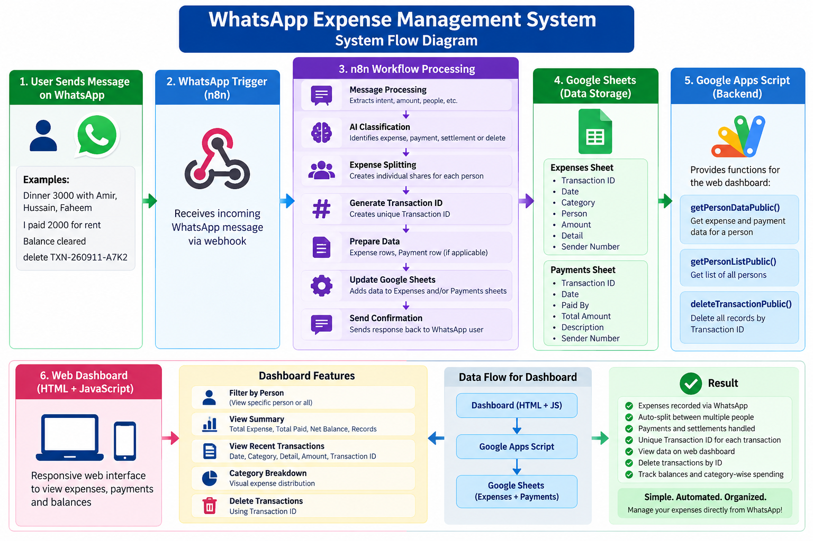

# WhatsApp Expense Management System

A WhatsApp-based expense management and tracking system built with **n8n, Google Sheets, Google Apps Script, and a responsive web dashboard**.

The system allows users to record expenses directly through WhatsApp, automatically split expenses between multiple people, record payments, manage settlements, and delete transactions using a unique Transaction ID.

---

## 🚀 Features

* Record expenses through WhatsApp
* Automatically identify expense category
* Support multiple people in a single expense
* Automatically split expenses into separate rows
* Generate a unique Transaction ID for each transaction
* Record payment information
* Support balance settlement
* Delete complete transactions using Transaction ID
* Delete multiple expense rows belonging to the same transaction
* Web-based expense dashboard
* View expenses by person
* View all expenses
* Calculate total expenses
* Calculate total payments
* Calculate net balance
* View category-wise expense breakdown
* View recent transactions
* Mobile-friendly dashboard
* Google Sheets used as the data storage layer

  
## 🔄 System Flow Diagram




## 📊 Google Sheets Structure

The system uses two main sheets.

### Expenses

The Expenses sheet stores individual expense shares.

Typical fields include:

```text
ID
Date
Category
Person
Amount
Detail
Sender Number
```

A single WhatsApp expense can generate multiple expense rows when the expense is shared between multiple people.

All rows generated from the same message use the same Transaction ID.

### Payments

The Payments sheet stores payment information.

Typical fields include:

```text
Date
Category
Paid By
Total Amount
Description
Sender Number
ID
```

## 🆔 Transaction ID

Every transaction receives a unique Transaction ID.

Example:

```text
TXN-260911-A7K2
```

The same Transaction ID is stored with all rows belonging to that transaction.

For example, if one expense is split between three people:

```text
TXN-260911-A7K2 → Person 1
TXN-260911-A7K2 → Person 2
TXN-260911-A7K2 → Person 3
```

The related payment record can also use the same Transaction ID.

This makes it possible to identify and manage the complete transaction as one unit.

---

## 💰 Expense Splitting

When a shared expense is received through WhatsApp, the n8n workflow processes the message and creates separate expense records for each person.

Example:

```text
Total Expense: 3000

Faheem       → 1000
Amir         → 1000
Hussain      → 1000
```

All three rows are associated with the same Transaction ID.

This structure allows the dashboard to calculate individual balances correctly.

---

## 💳 Payments

When an expense is recorded, the workflow can also create the related payment record.

The payment identifies:

* Who paid
* Total amount paid
* Transaction ID
* Date
* Description

The same Transaction ID connects the payment with its related expense records.

---

## 🤝 Settlement

The system also supports balance settlement.

Settlement messages such as:

```text
Balance cleared
Balance settled
Paid balance
Settlement
```

are interpreted as settlement transactions.

A settlement records the payment information and marks the balance as cleared without creating normal expense split rows.

---

## 🗑️ Delete Transactions

Transactions can be deleted using their Transaction ID.

Example:

```text
delete TXN-260911-A7K2
```

The system:

1. Extracts the Transaction ID.
2. Searches the Expenses sheet.
3. Searches the Payments sheet.
4. Finds all matching records.
5. Deletes all matching expense rows.
6. Deletes the matching payment record.
7. Sends a deletion confirmation through WhatsApp.

### Multiple Expense Rows

A single Transaction ID may belong to more than one expense row.

The workflow therefore identifies **all matching expense rows** before deletion.

Expense rows are processed from the bottom upward to prevent row-number shifting during deletion.

---

## 📱 Web Dashboard

The project includes a responsive web dashboard built using HTML, CSS, JavaScript, and Google Apps Script.

The dashboard provides:

### Person Filter

Users can select a specific person or view all records.

```text
All
Faheem
Amir
Hussain
...
```

### Summary

The dashboard displays:

```text
Total Expense
Total Paid
Net Balance
Records
```

### Recent Expenses

Recent expense records display information such as:

* Category
* Detail
* Transaction ID
* Date
* Person
* Amount

### Category Breakdown

Expenses are grouped by category to provide a quick overview of spending.

---

## ⚖️ Balance Calculation

The dashboard calculates balance using:

```text
Net Balance = Total Paid - Total Expense
```

A positive balance indicates that payments are greater than recorded expenses.

A negative balance indicates that recorded expenses are greater than payments.

---

## 🔄 Transaction Flow

A normal expense follows this flow:

```text
WhatsApp Message
       ↓
WhatsApp Trigger
       ↓
AI Message Processing
       ↓
Expense Classification
       ↓
Expense Splitting
       ↓
Transaction ID Generation
       ↓
Google Sheets
       ↓
WhatsApp Confirmation
```

The dashboard then reads the stored data through Google Apps Script.

---

## 🔧 Google Apps Script

The Apps Script backend provides functions for the dashboard, including:

```text
getPersonDataPublic()
getPersonListPublic()
deleteTransactionPublic()
```

These functions allow the dashboard to:

* Retrieve expense data
* Retrieve payment data
* Generate the person list
* Calculate totals
* Calculate balances
* Delete transactions

---

## 📖 Documentation

Detailed system documentation is available in:

```text
documentation/SYSTEM-DOCUMENTATION.md
```

It explains the complete workflow, data structure, transaction processing, dashboard functionality, and deletion system.

---
## 🛠️ Technologies Used

| Technology              | Purpose                                          |
| ----------------------- | ------------------------------------------------ |
| WhatsApp                | User interaction                                 |
| n8n                     | Workflow automation                              |
| AI Model                | Message understanding and expense classification |
| Google Sheets           | Expense and payment database                     |
| Google Apps Script      | Backend/API for dashboard                        |
| HTML / CSS / JavaScript | Web dashboard                                    |
| GitHub                  | Source code and project version control          |

---
## 🎯 Current System Capabilities

The system currently provides:

* WhatsApp expense entry
* AI-based expense processing
* Expense categorization
* Multi-person expense splitting
* Payment recording
* Settlement handling
* Transaction ID generation
* Transaction-based deletion
* Multi-row expense deletion
* Google Sheets storage
* Google Apps Script backend
* Responsive expense dashboard
* Person-based filtering
* Expense summaries
* Category breakdown

---

## 🔮 Future Improvements

Possible future enhancements include:

* Edit transactions by Transaction ID
* Advanced reporting
* Monthly expense reports
* Charts and visual analytics
* Export reports
* Authentication for the dashboard
* User-specific access control
* Automated monthly summaries
* Improved transaction search
* Audit logs
* Backup and recovery functionality

---
## 📖 Documentation

Detailed system documentation is available in:

[📥 Download System Documentation](WhatsApp_Expense_Management_System_Documentation.docx)

It explains the complete workflow, data structure, transaction processing, dashboard functionality, and deletion system.

---

## 📌 Portfolio Implementation

Built to demonstrate practical integration of voice AI, webhooks, Google Apps Script, and spreadsheet-based backend automation.

A sanitized n8n workflow file is included for portfolio demonstration.

👉 [View / Download Workflow](WhatsApp_Expense_Tracker_Final.json)

For custom implementation or commercial use, please <strong>Contact Us:</strong>
<a href="https://wa.me/923002120566"></a>   <a href="https://www.linkedin.com/in/faheem-abbas-ai-automation-specialist/"></a>

## 👨‍💻 Author

**Faheem Abbas**

AI Automation Specialist | n8n Expert | AI Agents | AI-Powered Business Automation | Lead Generation | API Integrations | Calling Agents

**#AI #AIAutomation #n8n #RAG #GoogleGemini #Pinecone #WhatsAppAutomation #LLM #AIEngineering #Automation #bluemoonways**
